# OpenWrt BLE Gateway

USB Bluetooth + BlueZ BLE gateway: scan advertisements, report over MQTT (optional TCP/UDP), and accept asset-platform commands (inventory / buzz / eink). Includes a LuCI app (`luci-app-btgateway`).

Current software version: **1.0.10**. The gateway is an MQTT **client**; it does not run a local broker.

中文: [README.md](README.md)

This page covers **first install through daily use**. Screenshots match the LuCI (Argon) UI.

## Contents

1. [Before you start & hardware](#1-before-you-start--hardware)
2. [Pick the right packages](#2-pick-the-right-packages)
3. [First install](#3-first-install)
4. [Log in](#4-log-in)
5. [Switch language](#5-switch-language)
6. [Confirm CPU architecture](#6-confirm-cpu-architecture)
7. [Gateway Settings](#7-gateway-settings)
8. [Bluetooth Settings](#8-bluetooth-settings)
9. [Scan List](#9-scan-list)
10. [Raw packets](#10-raw-packets)
11. [Device Control](#11-device-control)
12. [Check and install updates](#12-check-and-install-updates)
13. [First-run checklist](#13-first-run-checklist)
14. [Troubleshooting](#14-troubleshooting)

---

## 1. Before you start & hardware

You need:

- OpenWrt / ImmortalWrt **24.10** (opkg, not apk) with a working LuCI
- Admin login (usually `root`) and **this router’s** password
- A **USB Bluetooth adapter** (most boards have no onboard BLE)
- Broker or asset-platform MQTT/MQTTS host, port, and credentials if you want uplink

Without an adapter you can enable **Demo mode** on Gateway Settings to explore the UI. Demo mode cannot talk to real devices.

### 1.1 Common routers

| Board | `btgateway` arch | Notes |
| --- | --- | --- |
| CMCC RAX3000Z 算力版 / RAX3000M-eMMC | `aarch64` | MT7981, USB 3.0, primary test target |
| GL.iNet GL-MT3000 / MT6000 (Filogic) | `aarch64` | Plug in USB BLE |
| Raspberry Pi 4/5, ARM64 VMs | `aarch64` | Onboard or USB BLE |
| x86_64 soft routers | `x86_64` | USB BLE |
| Some 32-bit ARM | `arm` | See section 2 |

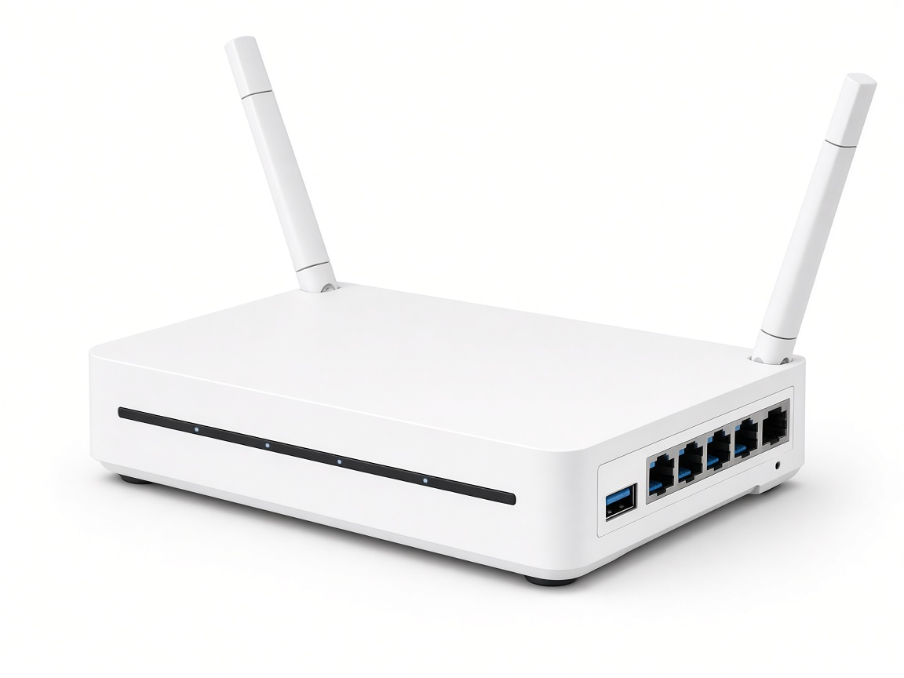

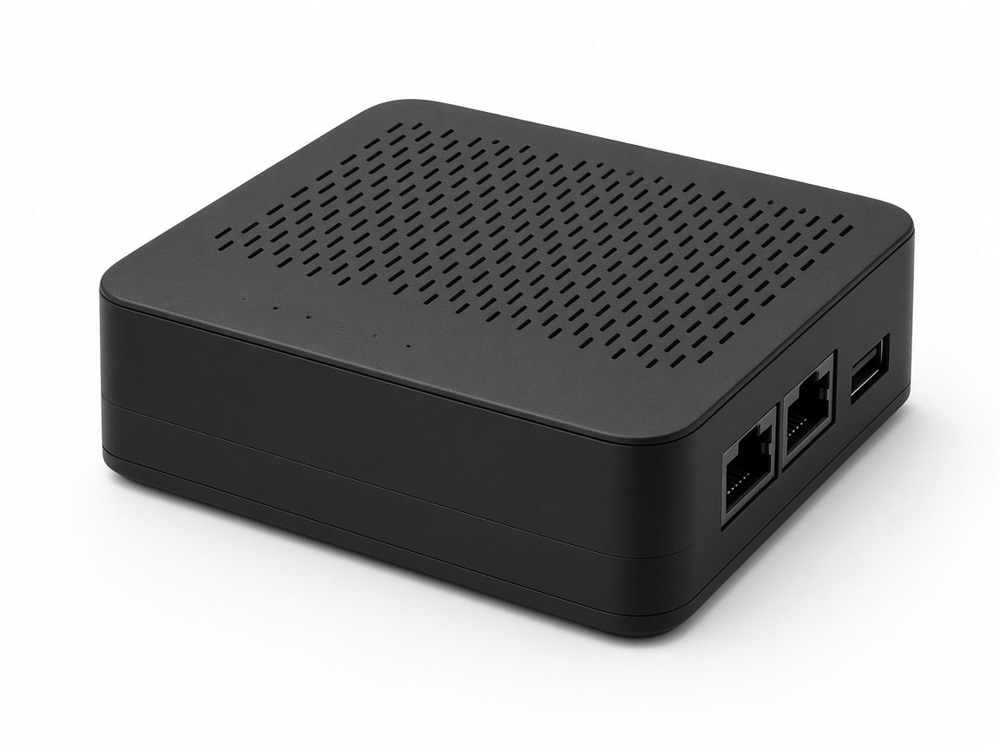

### 1.2 USB Bluetooth dongles

| Form factor | Common chip | Notes |
| --- | --- | --- |
| Black stick | RTL8761BU | Most common; firmware often bundled |
| Nano dongle | CSR8510 | Tiny |

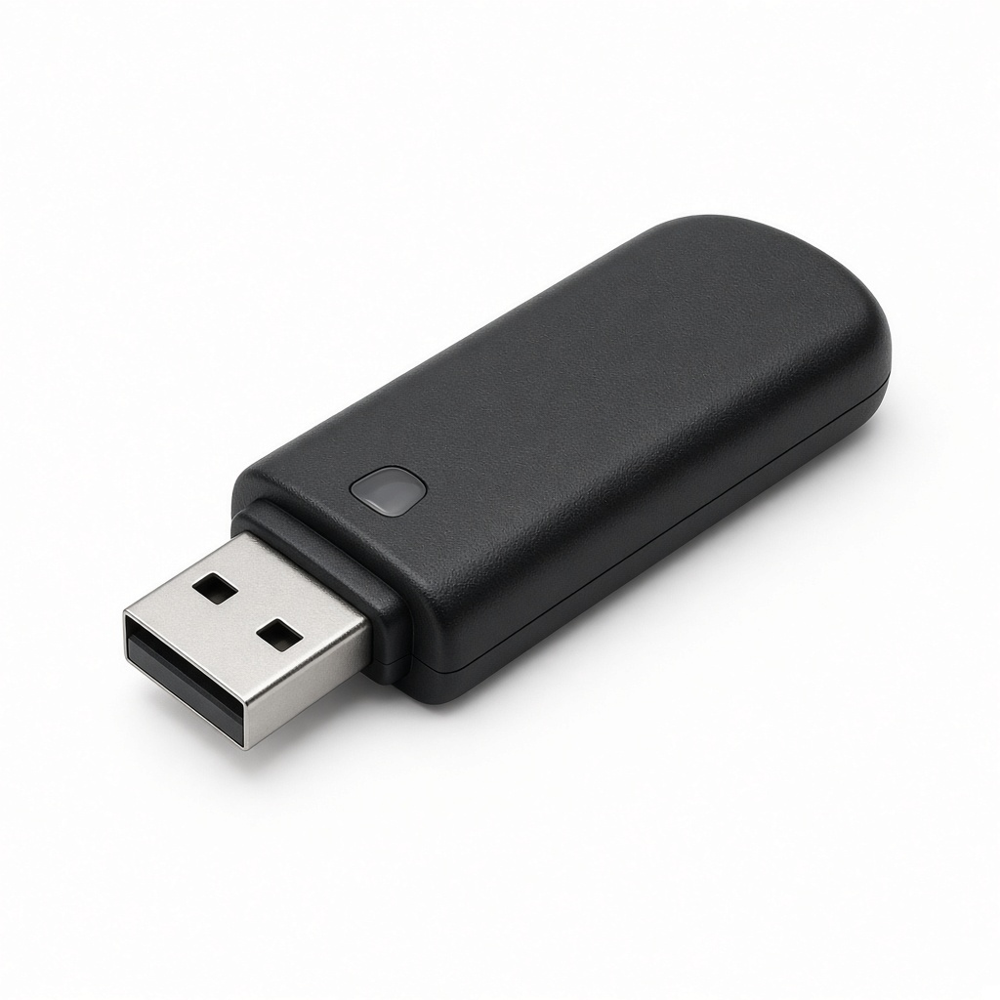

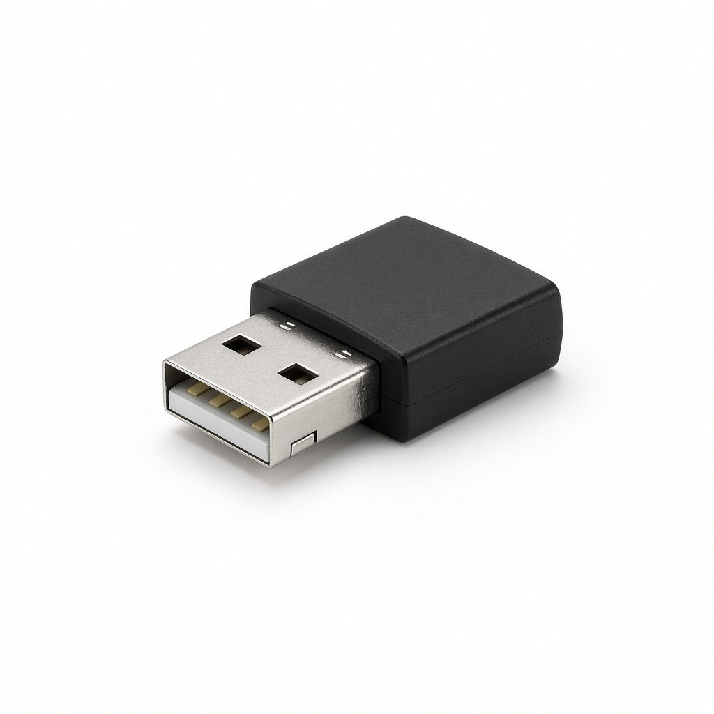

After plugging in, `bluetoothctl list` should show `hci0`. On a VM, pass the USB device through to the guest.

Releases:

- Repository: <https://github.com/komyo-wong/OpenWrt-BLE-Gateway>
- Version feed: <https://github.com/komyo-wong/OpenWrt-BLE-Gateway/blob/main/version.json>

---

## 2. Pick the right packages

Every install needs **two** ipks:

| Package | Architecture | Role |
| --- | --- | --- |
| `luci-app-btgateway_*-1_all.ipk` | `all` | LuCI app; one file for every board |
| `btgateway_*-1_<arch>.ipk` | see below | Gateway binary; must match the CPU |

| Board | Download |
| --- | --- |
| 64-bit ARM (RAX3000Z, Pi, `aarch64` / `armsr/armv8`) | `btgateway_1.0.10-1_aarch64.ipk` |
| 32-bit ARM v7 (`arm_cortex-a7`, GOARM=7) | `btgateway_1.0.10-1_arm.ipk` |
| x86_64 / amd64 | `btgateway_1.0.10-1_x86_64.ipk` |

Do **not** install an `all` file as the gateway binary — only the LuCI app is `all`. MIPS is not packaged yet.

Example 1.0.10 links (confirm against `version.json`):

- [luci-app-btgateway_1.0.10-1_all.ipk](https://raw.githubusercontent.com/komyo-wong/OpenWrt-BLE-Gateway/main/luci-app-btgateway_1.0.10-1_all.ipk)
- [btgateway_1.0.10-1_aarch64.ipk](https://raw.githubusercontent.com/komyo-wong/OpenWrt-BLE-Gateway/main/btgateway_1.0.10-1_aarch64.ipk)
- [btgateway_1.0.10-1_arm.ipk](https://raw.githubusercontent.com/komyo-wong/OpenWrt-BLE-Gateway/main/btgateway_1.0.10-1_arm.ipk)
- [btgateway_1.0.10-1_x86_64.ipk](https://raw.githubusercontent.com/komyo-wong/OpenWrt-BLE-Gateway/main/btgateway_1.0.10-1_x86_64.ipk)

opkg pulls `bluez-daemon` and `dbus` when the feeds are reachable.

---

## 3. First install

### 3.1 Upload in LuCI (recommended)

1. Open `http://<router-ip>/cgi-bin/luci` and log in.
2. **System → Software**.
3. **Upload Package…** — install matching `btgateway_*.ipk` first, then `luci-app-btgateway_*_all.ipk`.

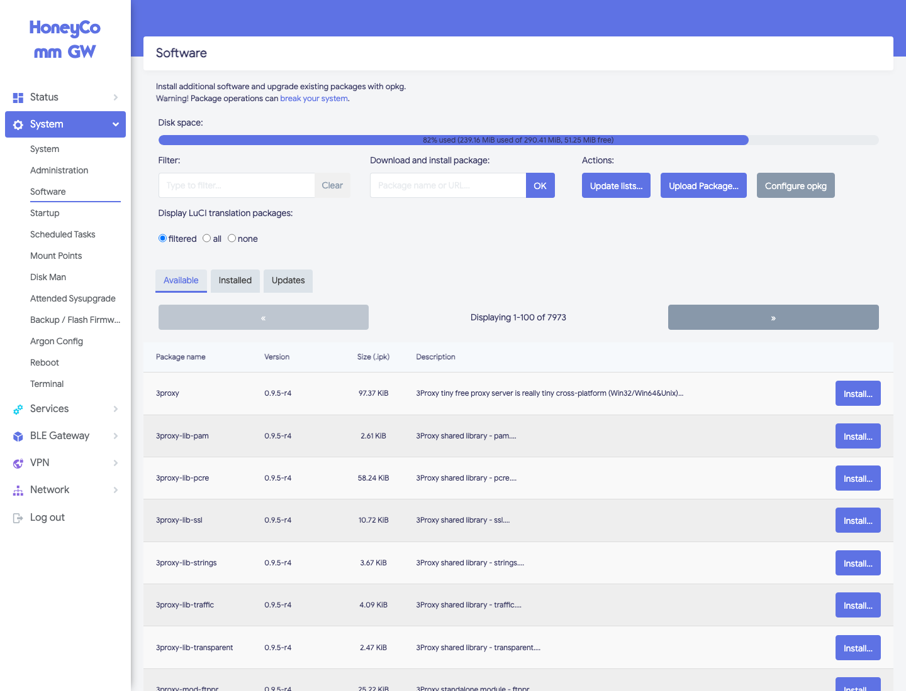

Refresh. **BLE Gateway** should appear in the menu. If not:

```sh
rm -f /tmp/luci-indexcache*
/etc/init.d/rpcd restart
```

### 3.2 SSH install

Replace `aarch64` with `arm` or `x86_64` as needed:

```sh
cd /tmp
wget -O btgateway.ipk https://raw.githubusercontent.com/komyo-wong/OpenWrt-BLE-Gateway/main/btgateway_1.0.10-1_aarch64.ipk
wget -O luci-app-btgateway.ipk https://raw.githubusercontent.com/komyo-wong/OpenWrt-BLE-Gateway/main/luci-app-btgateway_1.0.10-1_all.ipk
opkg update
opkg install ./btgateway.ipk ./luci-app-btgateway.ipk
/etc/init.d/btgateway enable
/etc/init.d/btgateway start
```

Plug in the USB adapter and confirm `hci0` with `bluetoothctl list`.

---

## 4. Log in

Open `http://<router-ip>/cgi-bin/luci`. Username is usually `root`. Use **this router’s** admin password.


---

## 5. Switch language

1. **System → System**.
2. **Language and Style**.
3. Choose `English` or `简体中文 (Simplified Chinese)`, **Save & Apply**, refresh.

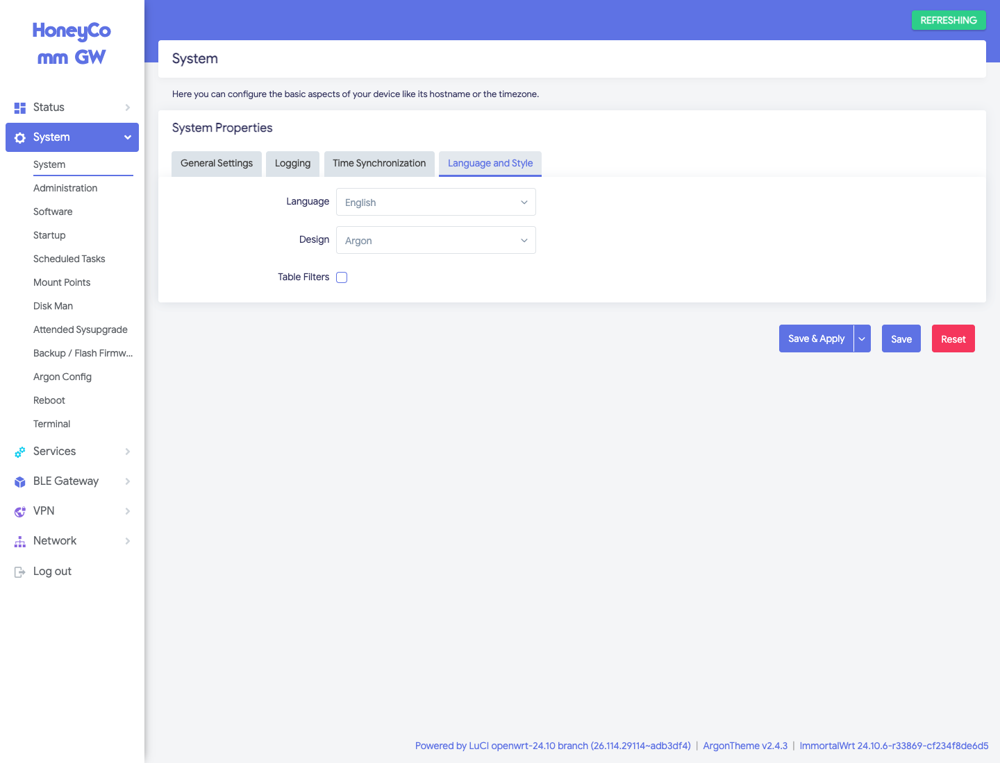

Set the timezone on the same page (e.g. `Asia/Shanghai`). Scan timestamps use the router clock.

---

## 6. Confirm CPU architecture

**Status → Overview** shows model, architecture, and target. Wrong `btgateway` arch = install or runtime failure.

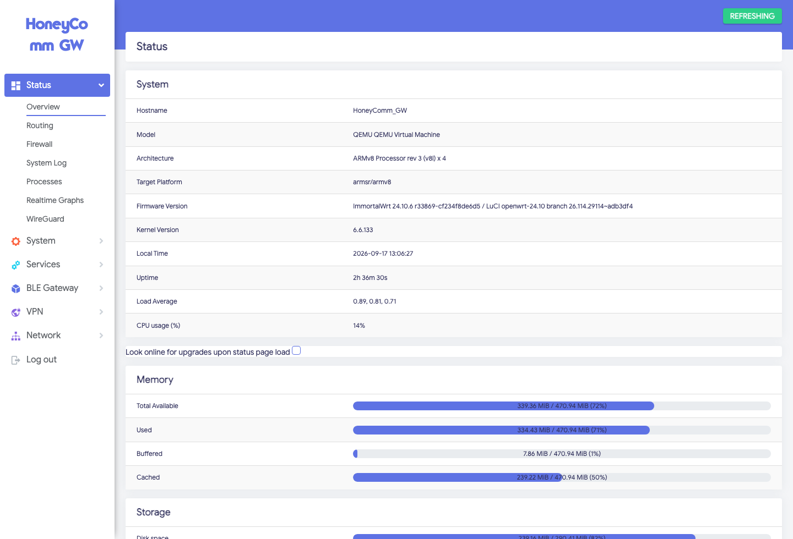

Example: architecture ARMv8 / target `armsr/armv8` → use the **aarch64** package.

---

## 7. Gateway Settings

**BLE Gateway → Gateway Settings**.

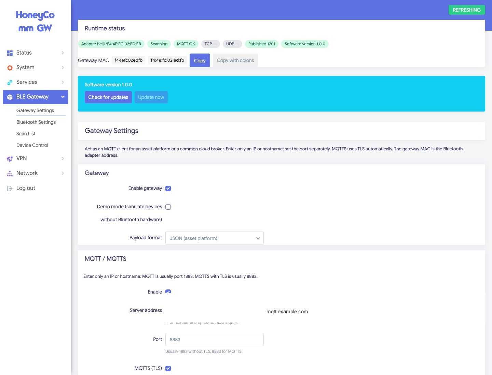

### 7.1 Status chips

| Chip | Meaning |
| --- | --- |
| Adapter `hci0` / MAC | USB BLE present |
| Scanning / idle | Continuous scan state |
| MQTT OK | Connected to broker; grey means not connected |
| Published | Uplink count since boot |
| Version | Gateway software version |

The **gateway MAC** is the adapter address (often used as the platform gateway id).

### 7.2 Enable the gateway

1. Check **Enable gateway**.
2. Leave **Demo mode** off when a real adapter is present.
3. Choose **Payload format** as required by your uplink.

**Save & Apply**.

### 7.3 MQTT / MQTTS

Scroll to the broker section. **Host is IP or hostname only** — no `mqtt://`. Port is separate (`1883` plain, usually `8883` for MQTTS).

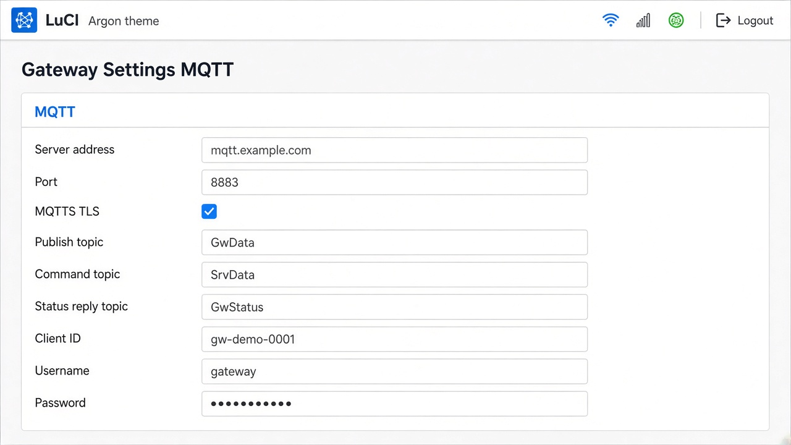

| Field | Notes |
| --- | --- |
| Enable | On |
| Server address | IP or hostname from your platform |
| Port | `1883` or `8883` |
| MQTTS (TLS) | On for encrypted brokers |
| Skip certificate verification | Self-signed only |
| Publish / command / status topics | Often `GwData` / `SrvData` / `GwStatus` |
| Client ID / username / password | Assigned by your platform |

Asset-platform (NATIVE) commands include `ble_buzz`, `ble_eink`, `inventory_start`, `inventory_stop`, plus Kunlun-style GATT ops. Results go upstream as `type=ack`.

TCP/UDP uplink is optional and off by default. After save, the top chip should show **MQTT OK**.

---

## 8. Bluetooth Settings

**BLE Gateway → Bluetooth Settings**.

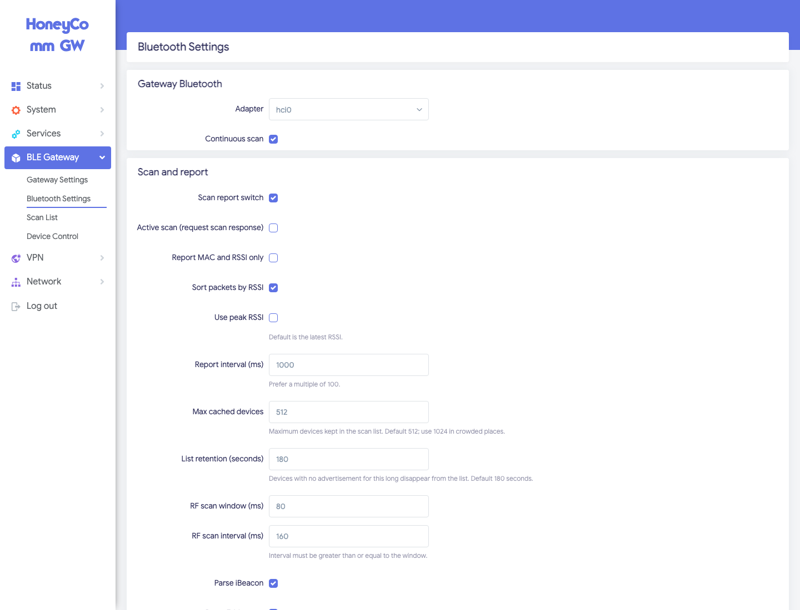

1. Select adapter `hci0`.
2. Enable **Continuous scan** and **Scan report**.
3. Tune active scan, RSSI-only mode, cache period (default `1000` ms), cache size, and list TTL as needed.

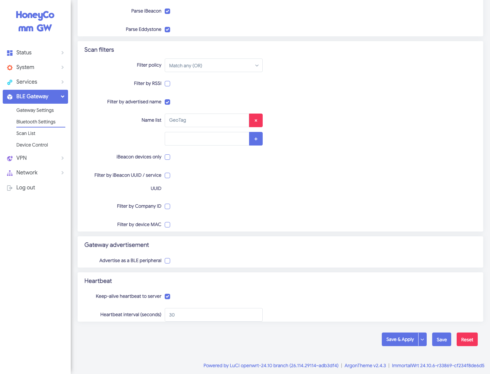

Filter policy, name/UUID/MAC filters, and the 30s keepalive toward the broker live on this page. **Save & Apply**.

---

## 9. Scan List

**BLE Gateway → Scan List** (refreshes about every 2s).

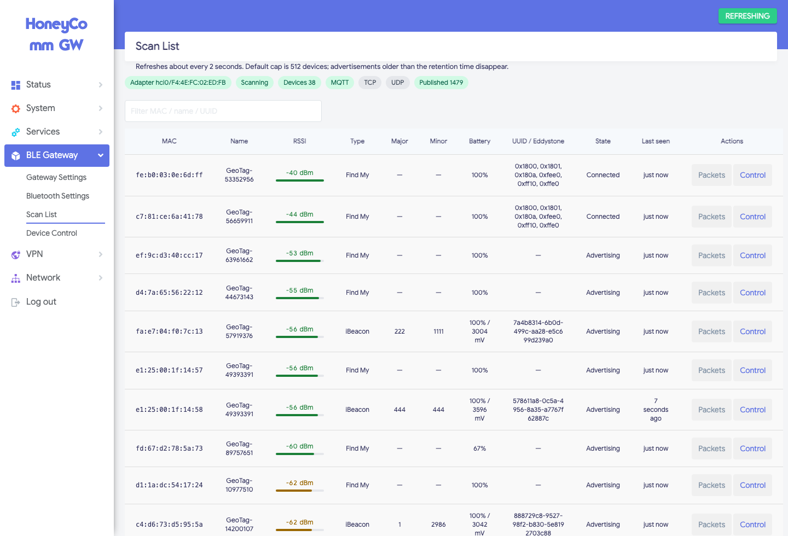

---

## 10. Raw packets

Click **Packets** on a row for up to three recent advertisements.

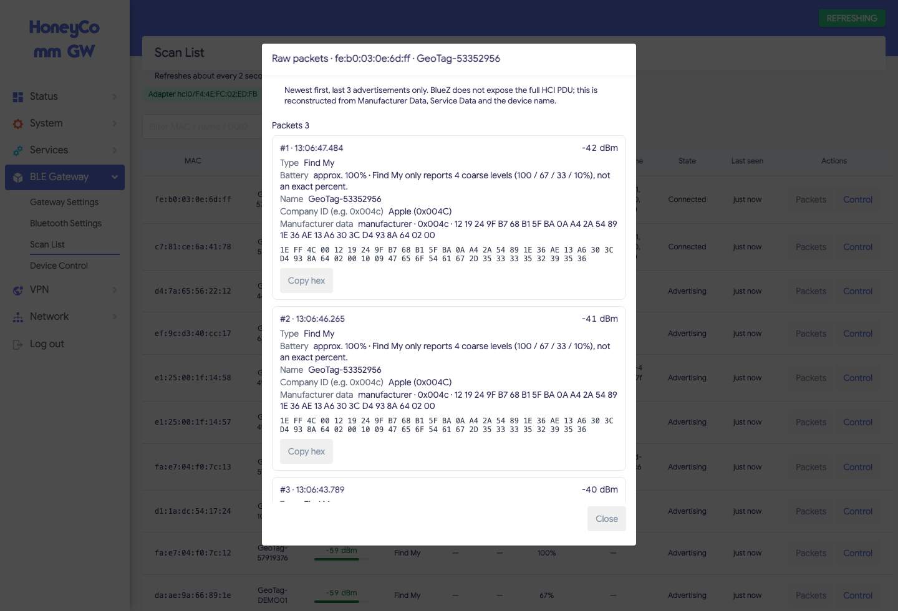

---

## 11. Device Control

Same command path as MQTT downlink.

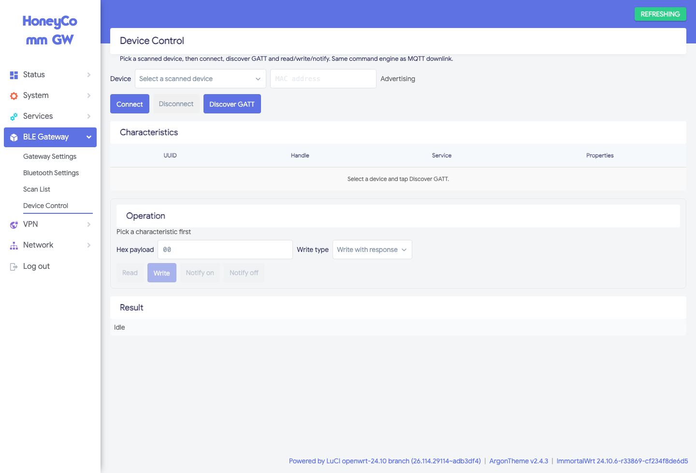

Typical flow: pick device → **Connect** → **Discover GATT** → read/write/notify → **Disconnect**.

While connecting, the gateway briefly pauses discovery to reduce USB-dongle link aborts. Passkey devices (some eink tags) use the built-in BlueZ agent; the default passkey is configurable.

---

## 12. Check and install updates

On **Gateway Settings**, use **Check for updates** / **Update now**. The router must reach GitHub `version.json` and the matching ipks.

---

## 13. First-run checklist

1. Matching `btgateway` + `luci-app-btgateway` installed.
2. USB BLE present (`hci0` + MAC).
3. Gateway enabled, demo off.
4. MQTT filled with **your** broker → **MQTT OK**.
5. Continuous scan + scan report on.
6. Devices appear; published count increases.

---

## 14. Troubleshooting

**No BLE Gateway menu** — reinstall the LuCI app; clear `/tmp/luci-indexcache*`.

**No adapter** — reseat USB; confirm BlueZ; pass through USB on VMs.

**Empty scan list** — scan off; filters too strict; no adapter and demo off.

**MQTT stays grey** — no `mqtt://` in host; port/TLS mismatch; credentials; reachability.

**Buzz / eink downlink does nothing** — register the gateway for NATIVE commands on the platform; device must be in range and connectable; check logs for `ack`.

**Wrong arch package** — e.g. aarch64 binary on 32-bit ARM will not run; use `*_arm.ipk`.

Chinese version: [README.md](README.md).
