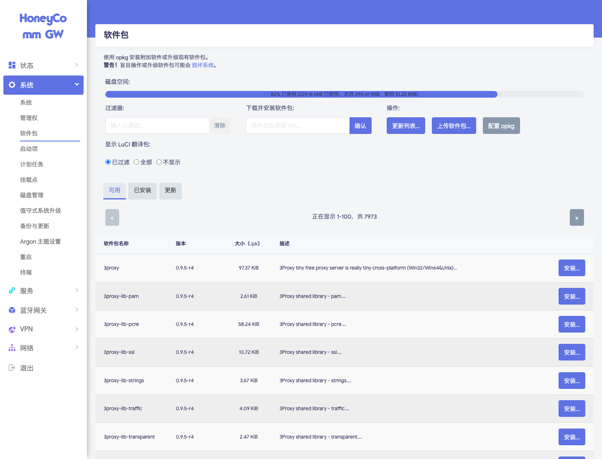
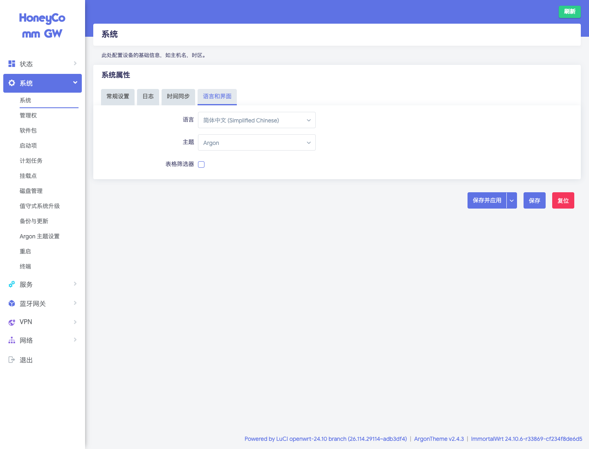
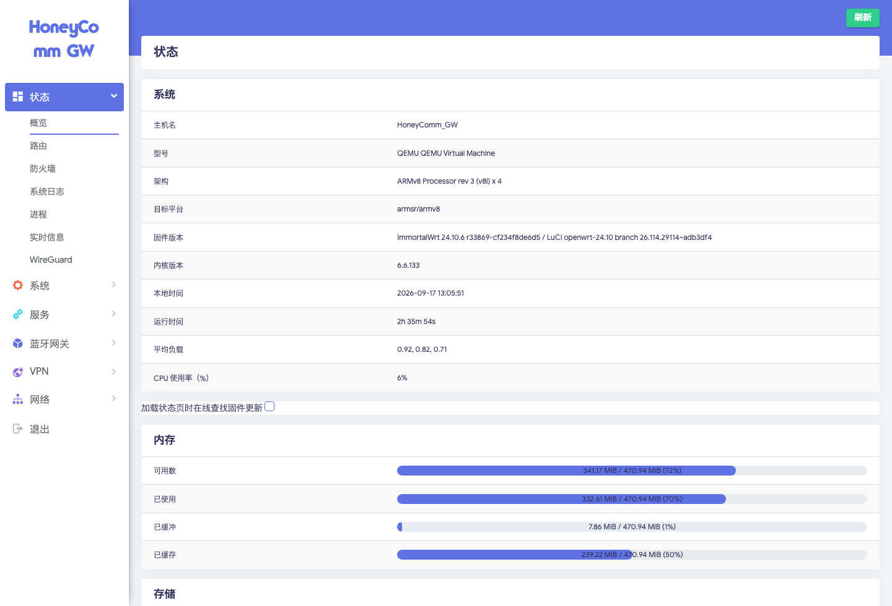
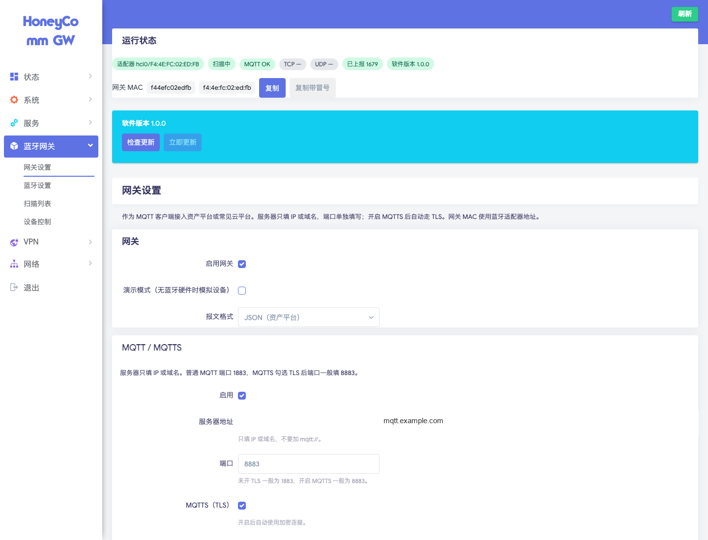
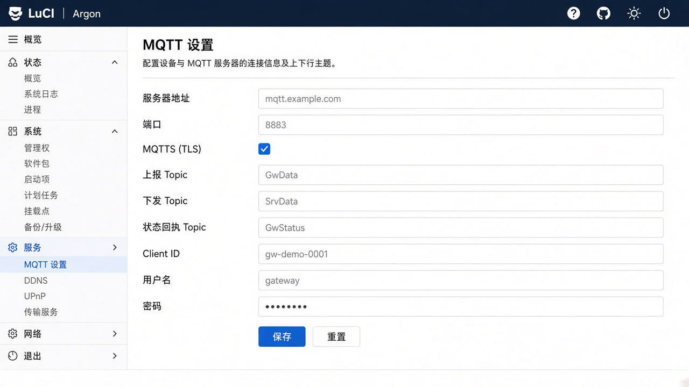
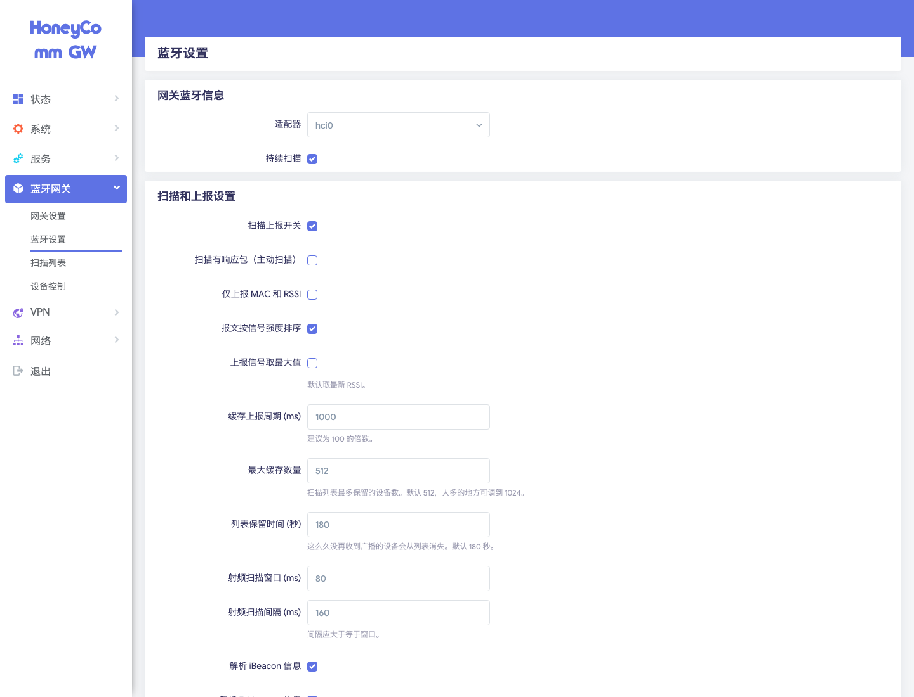
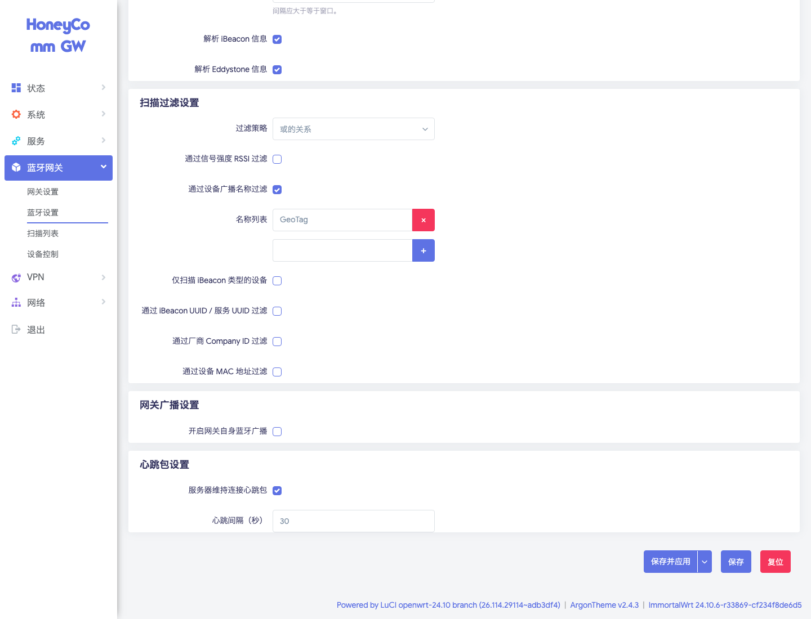
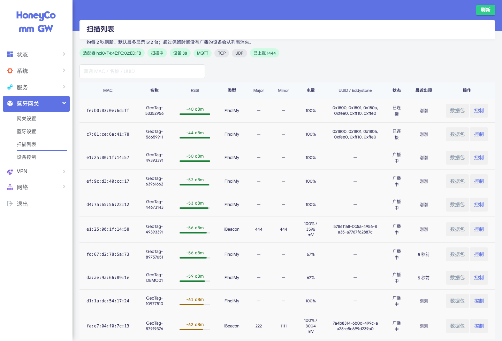
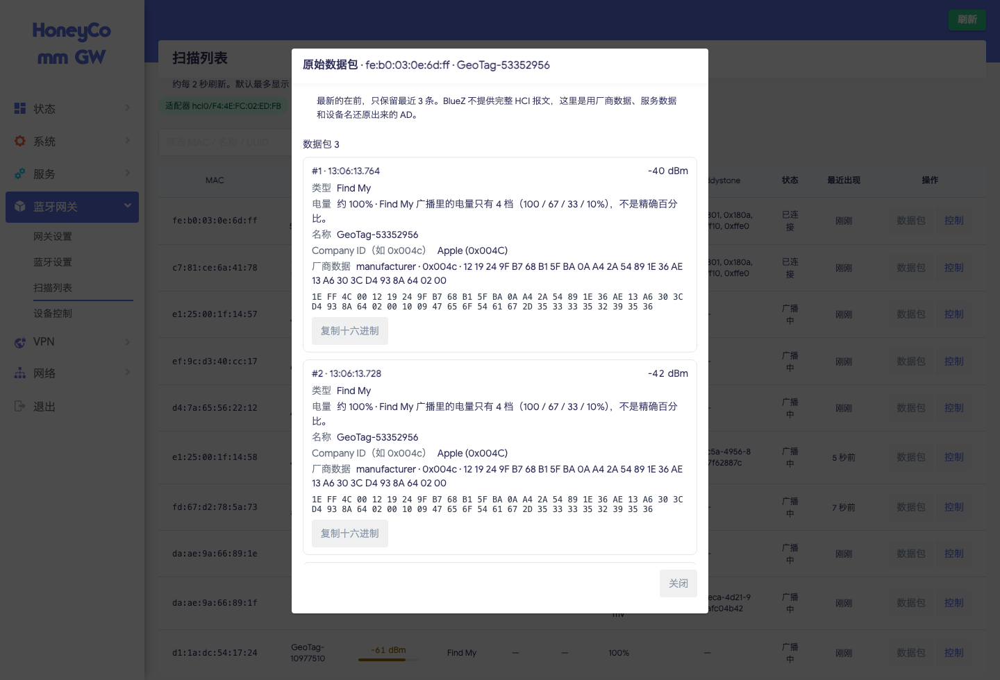
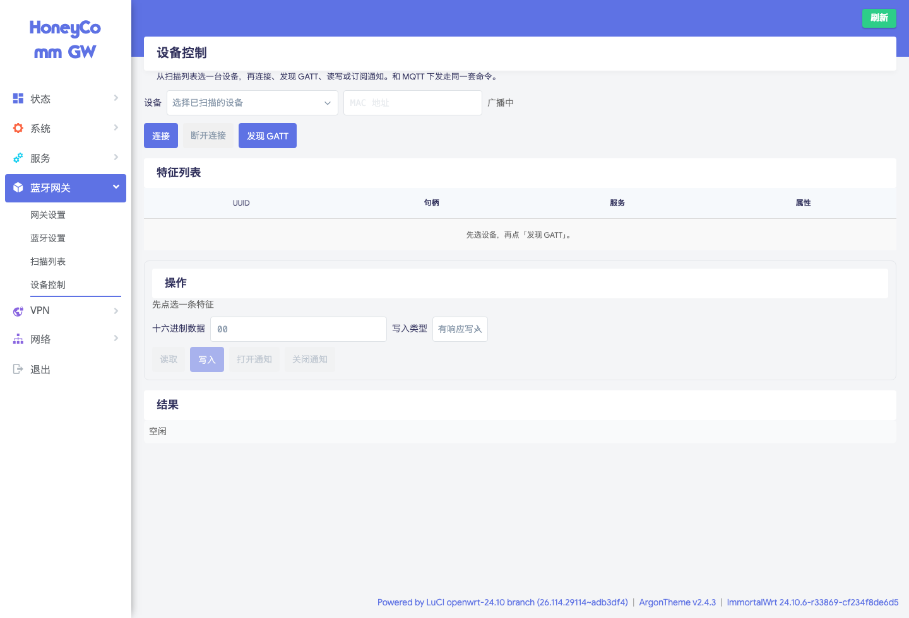

# OpenWrt 蓝牙网关

USB 蓝牙 + BlueZ 的 BLE 网关：扫描附近广播，经 MQTT（可选 TCP/UDP）上报；可对接资产平台下发盘点、蜂鸣、墨水屏等指令。带 LuCI 界面（`luci-app-btgateway`）。

当前软件版本：**1.0.10**。网关是 MQTT **客户端**，本机不运行 MQTT 服务器。

English: [README.en.md](README.en.md)

本页从**首次安装**写到**日常使用**。界面截图来自真实 LuCI（Argon）后台。

## 目录

1. [准备与硬件](#1-准备与硬件)
2. [选择安装包](#2-选择安装包)
3. [首次安装](#3-首次安装)
4. [登录后台](#4-登录后台)
5. [切换中英文](#5-切换中英文)
6. [确认硬件架构](#6-确认硬件架构)
7. [网关设置](#7-网关设置)
8. [蓝牙设置](#8-蓝牙设置)
9. [扫描列表](#9-扫描列表)
10. [原始数据包](#10-原始数据包)
11. [设备控制](#11-设备控制)
12. [检查与安装更新](#12-检查与安装更新)
13. [第一次跑通检查清单](#13-第一次跑通检查清单)
14. [常见问题](#14-常见问题)

---

## 1. 准备与硬件

你需要：

- 已能上网、能打开 LuCI 的 OpenWrt / ImmortalWrt **24.10**（opkg，不是 apk）
- 管理员账号（一般是 `root`）和**这台路由器自己的**登录密码
- **USB 蓝牙适配器**（多数机型没有板载蓝牙）
- 资产平台或云端 MQTT/MQTTS 的地址、端口、账号（若要用上报）

没有适配器时，可在网关设置里临时打开**演示模式**看界面，但不能连真实设备。

### 1.1 常见路由器

| 机型 | 装哪个 `btgateway` | 备注 |
| --- | --- | --- |
| CMCC RAX3000Z 算力版 / RAX3000M-eMMC | `aarch64` | MT7981，USB 3.0，推荐验证机 |
| GL.iNet GL-MT3000 / MT6000 等 | `aarch64` | Filogic，插 USB BLE |
| 树莓派 4/5、ARM64 虚机 | `aarch64` | 板载或 USB 蓝牙 |
| x86_64 软路由 | `x86_64` | 插 USB BLE |
| 部分 32 位 ARM | `arm` | 见第 2 节 |


### 1.2 USB 蓝牙

| 形态 | 芯片常见名 | 说明 |
| --- | --- | --- |
| 黑色长条 USB 棒 | RTL8761BU | 最常见，多数固件自带驱动/固件 |
| 纳米小棒 | CSR8510 | 体积小 |


插入后 SSH 执行 `bluetoothctl list`，应能看到 `hci0`。虚拟机需 USB 直通。

安装包：

- 仓库：<https://github.com/komyo-wong/OpenWrt-BLE-Gateway>
- 版本清单：<https://github.com/komyo-wong/OpenWrt-BLE-Gateway/blob/main/version.json>

---

## 2. 选择安装包

每次安装都要下 **两个** ipk：

| 包 | 架构 | 说明 |
| --- | --- | --- |
| `luci-app-btgateway_*-1_all.ipk` | `all` | 管理界面，所有机型同一份 |
| `btgateway_*-1_<架构>.ipk` | 见下表 | 网关程序，必须和路由器 CPU 一致 |

`btgateway` 架构对照：

| 路由器情况 | 下载的 `btgateway` |
| --- | --- |
| 64 位 ARM（RAX3000Z、树莓派、`aarch64` / `armsr/armv8`） | `btgateway_1.0.10-1_aarch64.ipk` |
| 32 位 ARM v7（`arm_cortex-a7` 等，GOARM=7） | `btgateway_1.0.10-1_arm.ipk` |
| x86_64 / amd64 | `btgateway_1.0.10-1_x86_64.ipk` |

**不要**用 `all` 当网关二进制：`luci-app-btgateway` 才是 `all`。MIPS（老 MT7621 等）目前没有包。

1.0.10 直链示例（以仓库根目录 / `version.json` 为准）：

- [luci-app-btgateway_1.0.10-1_all.ipk](https://raw.githubusercontent.com/komyo-wong/OpenWrt-BLE-Gateway/main/luci-app-btgateway_1.0.10-1_all.ipk)
- [btgateway_1.0.10-1_aarch64.ipk](https://raw.githubusercontent.com/komyo-wong/OpenWrt-BLE-Gateway/main/btgateway_1.0.10-1_aarch64.ipk)
- [btgateway_1.0.10-1_arm.ipk](https://raw.githubusercontent.com/komyo-wong/OpenWrt-BLE-Gateway/main/btgateway_1.0.10-1_arm.ipk)
- [btgateway_1.0.10-1_x86_64.ipk](https://raw.githubusercontent.com/komyo-wong/OpenWrt-BLE-Gateway/main/btgateway_1.0.10-1_x86_64.ipk)

若还不知道架构：打开 `http://路由器IP/`，按第 6 节看「状态 → 概览」里的**架构 / 目标平台**。

依赖由 opkg 拉取：`bluez-daemon`、`dbus`。路由器需要能访问软件源，或事先已装好 BlueZ。

---

## 3. 首次安装

### 3.1 网页上传（推荐）

1. 用浏览器打开 `http://<路由器IP>/cgi-bin/luci` 并登录。
2. 左侧 **系统 → 软件包**（英文界面是 **System → Software**）。
3. 点 **上传软件包**，先上传匹配架构的 `btgateway_*.ipk`，再上传 `luci-app-btgateway_*_all.ipk`。
4. 也可以把 ipk 的直链贴进「下载并安装软件包」输入框，点 **确认**。



装完后刷新页面。左侧应出现 **蓝牙网关**。若没有，SSH 执行：

```sh
rm -f /tmp/luci-indexcache*
/etc/init.d/rpcd restart
```

然后强制刷新浏览器。

### 3.2 SSH 安装

把下面的 `aarch64` 换成你的架构（`arm` 或 `x86_64`）：

```sh
cd /tmp
wget -O btgateway.ipk https://raw.githubusercontent.com/komyo-wong/OpenWrt-BLE-Gateway/main/btgateway_1.0.10-1_aarch64.ipk
wget -O luci-app-btgateway.ipk https://raw.githubusercontent.com/komyo-wong/OpenWrt-BLE-Gateway/main/luci-app-btgateway_1.0.10-1_all.ipk
opkg update
opkg install ./btgateway.ipk ./luci-app-btgateway.ipk
/etc/init.d/btgateway enable
/etc/init.d/btgateway start
```

插入 USB 蓝牙适配器。命令行可用 `hciconfig` 或 `bluetoothctl list` 确认出现 `hci0`。

---

## 4. 登录后台

浏览器打开 `http://<路由器IP>/cgi-bin/luci`（常见为 `192.168.1.1` 或你规划的 LAN 地址）。用户名一般是 `root`，密码是**这台路由器自己的管理密码**。


点 **登录**。之后左侧菜单即可进入蓝牙网关。

---

## 5. 切换中英文

1. 打开 **系统 → 系统**。
2. 点标签 **语言和界面**。
3. **语言**选 `简体中文 (Simplified Chinese)` 或 `English`。选 `auto` 则跟随浏览器语言。
4. 点右下角 **保存并应用**，再刷新页面。



同一页的 **常规设置** 里把时区设成实际时区（例如 `Asia/Shanghai`）。扫描上报时间用的是路由器本地时钟。

---

## 6. 确认硬件架构

**状态 → 概览** 里可看到型号、架构、目标平台。选错 `btgateway` 架构时，安装会失败或进程无法运行。



示例：`架构` 为 ARMv8、`目标平台` 为 `armsr/armv8` → 安装 `aarch64` 包。

---

## 7. 网关设置

左侧 **蓝牙网关 → 网关设置**。这是启用网关、填 MQTT、看运行状态和做在线更新的地方。



### 7.1 运行状态

顶部色块表示当前状态：

| 色块 | 含义 |
| --- | --- |
| 适配器 `hci0` / MAC | USB 蓝牙已识别且加电 |
| 扫描中 / 未扫描 | 是否在持续扫描 |
| MQTT OK | 已连上 Broker；灰色 `MQTT —` 表示未连 |
| TCP / UDP | 可选上报通道，灰色表示未启用或未连 |
| 已上报 | 开机以来交给 MQTT/TCP/UDP 的条数 |
| 软件版本 | 当前网关程序版本 |

**网关 MAC** 就是蓝牙适配器地址（资产平台常用它当网关 ID）。可点 **复制**。

### 7.2 网关开关

1. 勾选 **启用网关**。
2. 有真实适配器时，**不要**勾选演示模式。
3. 按实际对接需要选择 **报文格式**。

点页面底部 **保存并应用**。

### 7.3 MQTT / MQTTS

向下滚动填写 Broker。**服务器地址只填 IP 或域名**，不要加 `mqtt://`。端口单独填：明文一般 `1883`，MQTTS 一般 `8883`。



按平台文档填写。字段含义：

| 字段 | 说明 |
| --- | --- |
| 启用 | 勾选 |
| 服务器地址 | 平台提供的 IP 或域名 |
| 端口 | `1883` 或 `8883` |
| MQTTS (TLS) | 加密时勾选 |
| 跳过证书校验 | 仅自签证书时勾选 |
| CA 证书 | 需要校验证书时上传 PEM/CRT |
| 上报 Topic | 常用 `GwData` |
| 允许 MQTT 下发指令 | 需要远程盘点 / 蜂鸣 / 改屏 / GATT 时勾选 |
| 下发 Topic | 常用 `SrvData` |
| 状态回执 Topic | 常用 `GwStatus` |
| Client ID / 用户名 / 密码 | 平台分配的网关账号 |

资产平台下发（NATIVE）常见命令：`ble_buzz`、`ble_eink`、`inventory_start`、`inventory_stop`；另支持昆仑风格 GATT 指令。执行结果会以 `type=ack` 上报。

TCP / UDP 上报可选，默认关闭。

保存后回到页面顶部：MQTT 应变为 **MQTT OK**，「已上报」会随扫描增加。

---

## 8. 蓝牙设置

**蓝牙网关 → 蓝牙设置**。



### 8.1 适配器与扫描

1. **适配器**选已识别的 `hci0`（后面会带 MAC）。
2. 勾选 **持续扫描**，扫描列表才会不断刷新。
3. 勾选 **扫描上报开关**，扫描结果才会发到 MQTT。
4. **扫描有响应包（主动扫描）**：需要 Scan Response 里的名字/数据时再开。
5. **仅上报 MAC 和 RSSI**：只要定位强度、不要广播内容时勾选。
6. **缓存上报周期** 建议 100 的倍数，默认 `1000` ms。
7. **最大缓存数量** 默认 512。
8. **列表保留时间** 默认 180 秒。

### 8.2 过滤、自身广播、心跳



- **过滤策略**：`或` / `与`。
- 可按 RSSI、广播名、仅 iBeacon、UUID、Company ID、MAC 段过滤。
- **网关自身蓝牙广播**：一般保持关闭。
- **服务器维持连接心跳包**：默认开启，间隔 30 秒。

改完点 **保存并应用**。

---

## 9. 扫描列表

**蓝牙网关 → 扫描列表**。大约每 2 秒刷新。



| 列 | 含义 |
| --- | --- |
| MAC | 设备地址 |
| 名称 | 广播名 |
| RSSI | 信号 |
| 类型 | iBeacon / Find My / 标签 / 传感器 / 通用 ADV 等 |
| 状态 | 广播中 或 已连接 |
| 操作 | **数据包**、**控制** |

---

## 10. 原始数据包

在某一行点 **数据包**，弹出最近最多 3 条广播（新的在前）。



---

## 11. 设备控制

扫描列表点 **控制**，或打开 **蓝牙网关 → 设备控制**。与 MQTT 下发共用一套命令路径。



典型顺序：选设备 → **连接** → **发现 GATT** → 读写/通知 → **断开**。

扫描过程中连接时，网关会短暂暂停发现再恢复，降低 USB 适配器上的连接中断。需 Passkey 的设备（如部分墨水屏标签）由网关内置配对代理处理，默认口令可配置。

---

## 12. 检查与安装更新

更新入口在 **网关设置** 顶部。

1. 打开 **蓝牙网关 → 网关设置**。
2. 点 **检查更新** / **立即更新**。
3. 路由器需要能访问 GitHub 上的 `version.json` 与 ipk。

---

## 13. 第一次跑通检查清单

1. 已安装匹配架构的 `btgateway` + `luci-app-btgateway`。
2. USB 蓝牙已插入，能看到 `hci0` 和 MAC。
3. **启用网关**，演示模式关闭。
4. MQTT 已填（你自己的地址）、顶部 **MQTT OK**。
5. **持续扫描**、**扫描上报开关** 已勾，并保存。
6. 扫描列表有设备；「已上报」在增加。

---

## 14. 常见问题

**左侧没有「蓝牙网关」**  
重装 `luci-app-btgateway`，删除 `/tmp/luci-indexcache*`。

**适配器未检测到**  
换口、换线；确认 BlueZ；虚拟机要 USB 直通。

**扫描列表是空的**  
未开持续扫描；过滤过严；没插适配器又没开演示模式。

**MQTT 一直是灰色**  
地址不要带 `mqtt://`；端口与 TLS 成对；账号密码；路由器能否访问该 Broker。

**下发蜂鸣/改屏无效**  
平台侧网关应登记为支持 NATIVE 命令；设备需在扫描范围内且可连接；看系统日志里是否有 `ack`。

**32 位 ARM 装了 aarch64 包**  
改下 `btgateway_*_arm.ipk`。

English version: [README.en.md](README.en.md).
